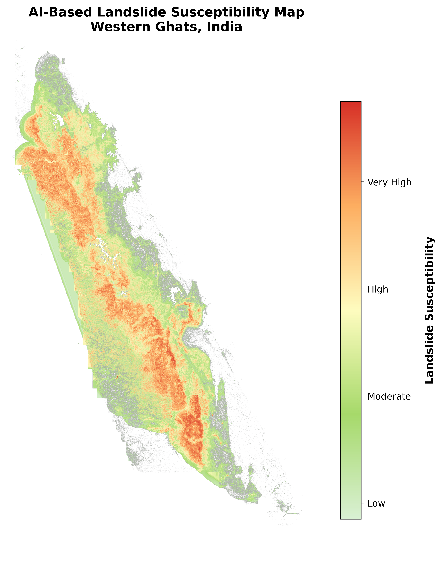
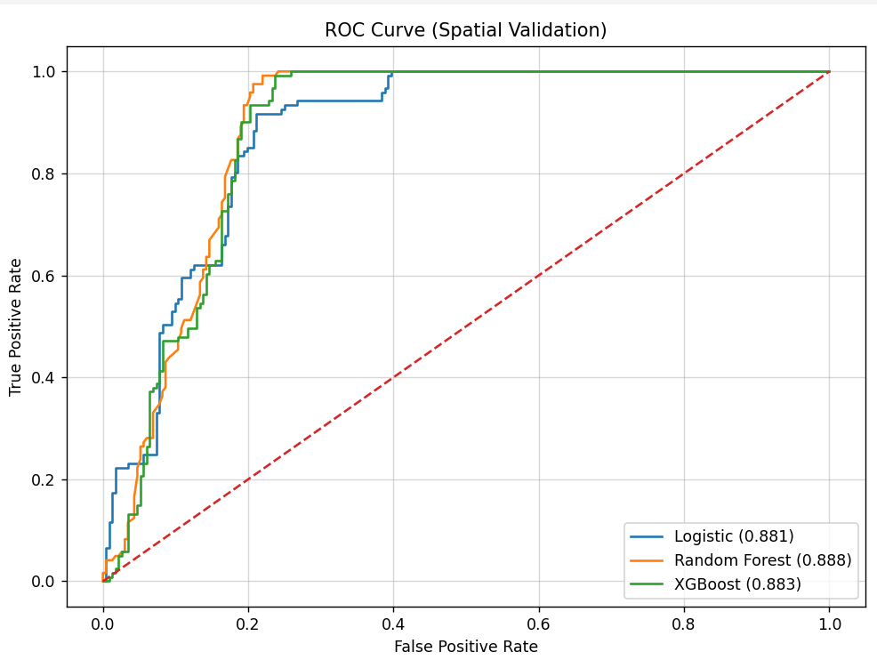
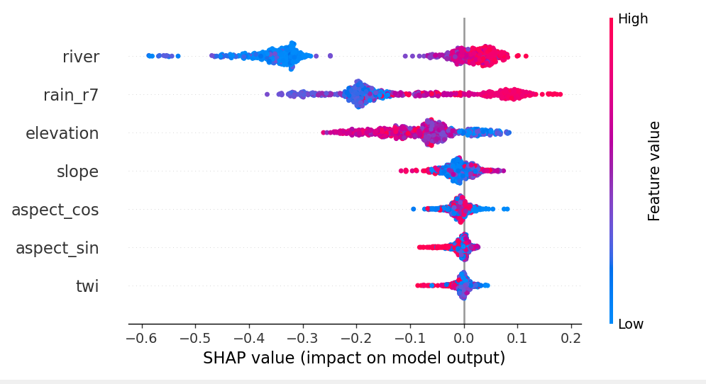
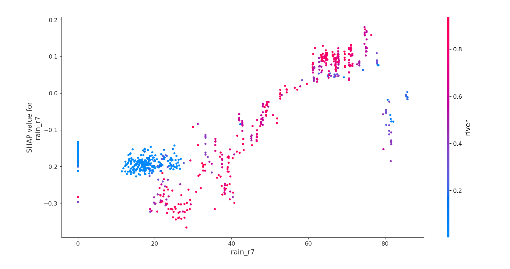
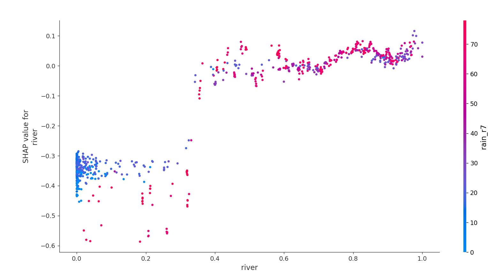
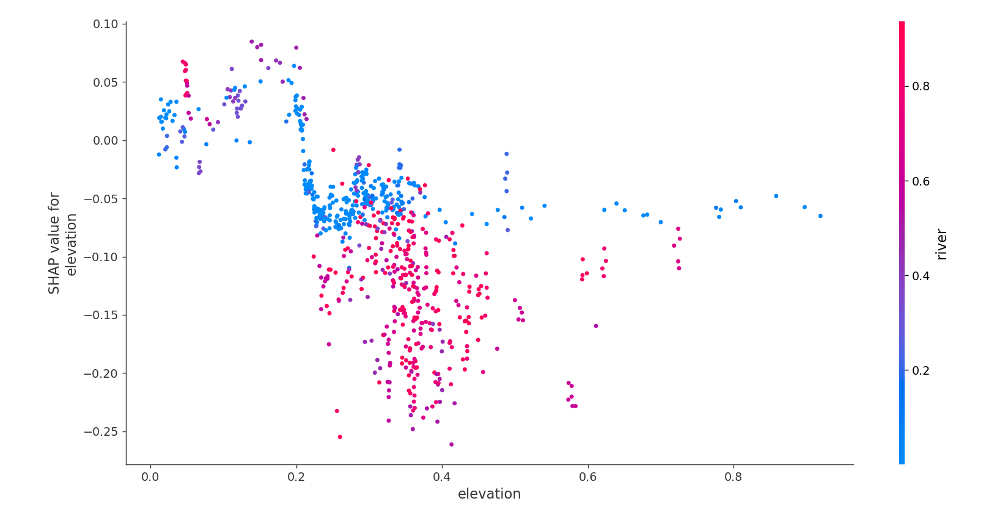
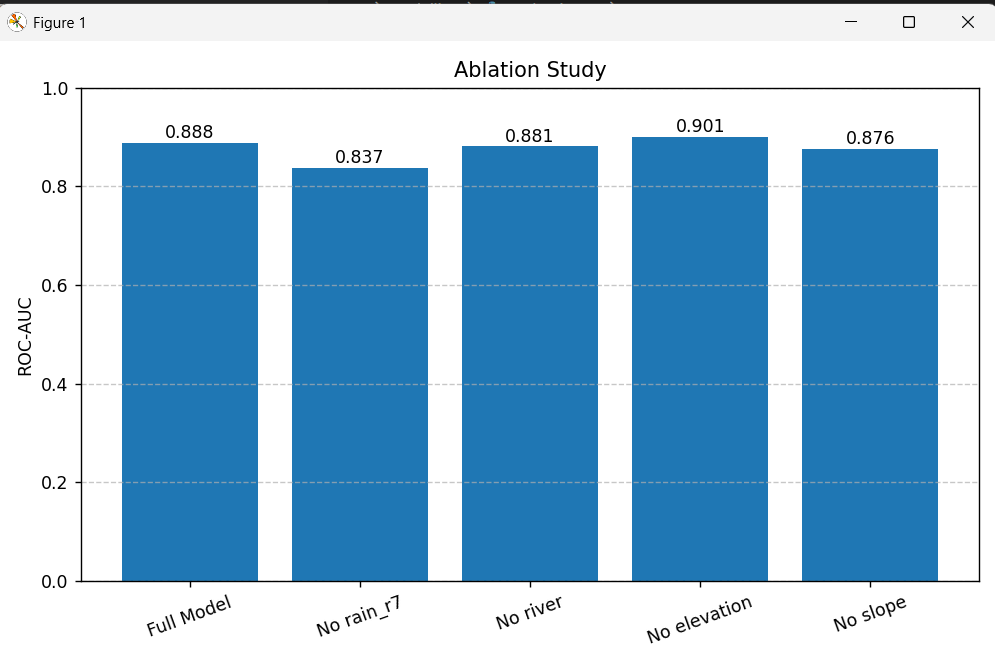
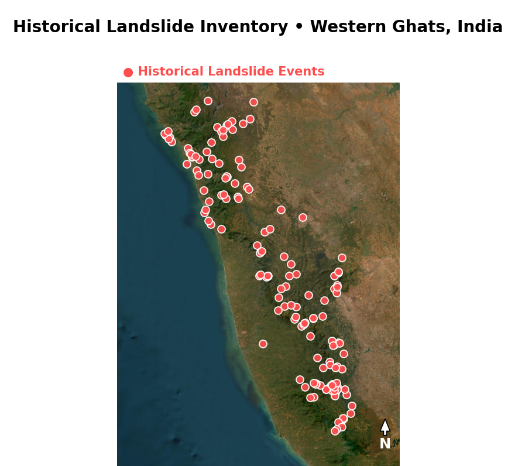

# 🌍 A Geospatial Machine Learning Framework for Landslide Susceptibility Assessment Using Historical Inventories and Spatial Block Validation

> Spatially robust landslide susceptibility mapping using explainable machine learning, historical inventory reconstruction, SHAP interpretability, and spatial block validation in the Western Ghats, India.

---

# 🚀 Project Highlights

✅ Spatial Block Validation  
✅ Historical Landslide Inventory Reconstruction  
✅ Explainable AI (SHAP)  
✅ Ablation-Based Feature Analysis  
✅ Geospatial Machine Learning Pipeline  
✅ Landslide Susceptibility Mapping  
✅ Random Forest / XGBoost / Logistic Regression Benchmarking  
✅ Real-World Western Ghats Terrain Data  

---

# 🌋 Final Landslide Susceptibility Map

<p align="center">
  
</p>

The generated susceptibility map highlights spatially varying landslide-prone zones across the Western Ghats region using spatially validated machine learning predictions.

---

# 📊 Spatial Validation ROC Curve

<p align="center">
  
</p>

### Spatial Block Validation Performance

| Model | ROC-AUC |
|---|---|
| Logistic Regression | 0.881 |
| Random Forest | 0.888 |
| XGBoost | 0.883 |

Unlike conventional random train-test splitting, spatial block validation evaluates geographic generalization capability under spatially separated terrain conditions.

---

# 🧠 Explainable AI using SHAP

## SHAP Summary Plot

<p align="center">
  
</p>

SHAP explainability was integrated to interpret nonlinear environmental interactions influencing landslide susceptibility predictions.

---

# 🌧️ Rainfall Dependence Analysis

<p align="center">
  
</p>

The analysis revealed rainfall as the dominant transferable susceptibility driver under geographically separated spatial validation.

---

# 🌊 River Influence Analysis

<p align="center">
  
</p>

Hydrological proximity demonstrated strong localized influence on terrain instability and susceptibility prediction behavior.

---

# ⛰️ Elevation Dependence Analysis

<p align="center">
  
</p>

Elevation interactions revealed nonlinear susceptibility responses across varying terrain regimes.

---

# 🔬 Ablation Study

<p align="center">
  
</p>

Ablation-based feature removal experiments demonstrated:

- Rainfall as the strongest susceptibility contributor
- Moderate hydrological influence
- Spatially transferable environmental controls
- Potential redundancy within elevation-derived predictors

---

# 🌍 Study Area

<p align="center">
  
</p>

### Study Region
Western Ghats, Karnataka, India

The study region is characterized by:

- High monsoonal rainfall
- Steep terrain gradients
- Dense hydrological networks
- Frequent rainfall-triggered slope failures
- Geomorphologically sensitive escarpments

---

# 🛰️ Historical Landslide Inventory Reconstruction

A reconstructed historical landslide inventory was developed using documented Western Ghats landslide events collected from multiple reports and disaster records.

### Inventory Processing Pipeline

```plaintext
Historical Landslide Events
            ↓
Coordinate Cleaning
            ↓
CRS Reprojection
            ↓
Buffered Event Generation
            ↓
Rasterization
            ↓
Spatial Alignment
            ↓
ML Training Labels
```

The generated raster inventory was spatially aligned with environmental predictors for supervised susceptibility modeling.

---

# ⚙️ Environmental Features Used

| Feature | Description |
|---|---|
| Slope | Terrain steepness |
| Aspect (sin/cos) | Terrain orientation |
| Rainfall (R7 Mean) | Multi-day rainfall intensity |
| Elevation | Terrain altitude |
| River Influence | Hydrological proximity |
| TWI | Topographic Wetness Index |
| Curvature | Surface morphology |

---

# 🤖 Machine Learning Models

The following machine learning models were evaluated:

| Model | Purpose |
|---|---|
| Logistic Regression | Linear baseline susceptibility model |
| Random Forest | Nonlinear ensemble susceptibility model |
| XGBoost | Gradient boosting susceptibility framework |

---

# 🧪 Spatial Block Validation

Unlike conventional random splitting approaches, the framework uses geographically separated spatial block validation to reduce spatial autocorrelation leakage.

This provides:

✅ More realistic regional evaluation  
✅ Better geographic generalization assessment  
✅ Increased geospatial ML rigor  
✅ Improved research reproducibility  

---

# 🧬 Geospatial ML Pipeline

```plaintext
DEM + Rainfall + Hydrology + Terrain Features
                    ↓
         Feature Engineering
                    ↓
        Spatial Block Validation
                    ↓
 Logistic / Random Forest / XGBoost
                    ↓
         SHAP Explainability
                    ↓
         Ablation Experiments
                    ↓
      Landslide Susceptibility Map
```

---

# 🏆 Key Contributions

### ✅ Historical inventory reconstruction using real documented landslide events

### ✅ Spatially robust geospatial machine learning validation

### ✅ Explainable susceptibility interpretation using SHAP

### ✅ Ablation-based environmental contribution analysis

### ✅ Operational susceptibility mapping pipeline

---

# 📁 Repository Structure

```plaintext
spatial-landslide-susceptibility-ml/
│
├── data/
├── models/
├── results/
│   ├── ablation_study.png
│   ├── landslide_susceptibility_map.png
│   ├── shap_summary_plot.png
│   ├── shap_rainfall_dependence.png
│   ├── shap_river_dependence.png
│   ├── shap_elevation_dependence.png
│   ├── spatial_validation_roc_curve.png
│   └── study_area_map.png
│
├── src/
│   ├── preprocessing/
│   ├── dataset/
│   ├── models/
│   └── prediction/
│
├── requirements.txt
├── README.md
└── LICENSE
```

---

# 🚀 Installation

Clone repository:

```bash
git clone https://github.com/gautam-gowda/spatial-landslide-susceptibility-ml.git
```

Install dependencies:

```bash
pip install -r requirements.txt
```

---

# ▶️ Usage

Run the workflow:

```bash
python src/dataset/dataset_creation.py

python src/models/train_model.py

python src/models/evaluation.py
```

---

# 📦 Dependencies

Major libraries used:

- NumPy
- Pandas
- Rasterio
- GeoPandas
- Scikit-learn
- XGBoost
- SHAP
- Matplotlib

---

# ⚠️ Notes

- Large raster datasets are excluded from GitHub due to storage limitations.
- Some scripts may require local dataset path modification before execution.
- Historical inventory coordinates were reconstructed from documented regional landslide records.

---

# 🧠 Future Improvements

- Lithology integration
- Soil type modeling
- Temporal rainfall dynamics
- External regional validation
- Uncertainty quantification
- Multi-temporal susceptibility assessment

---

# 👨‍💻 Author

## Gautam Gowda

---

# 📜 License

MIT License
